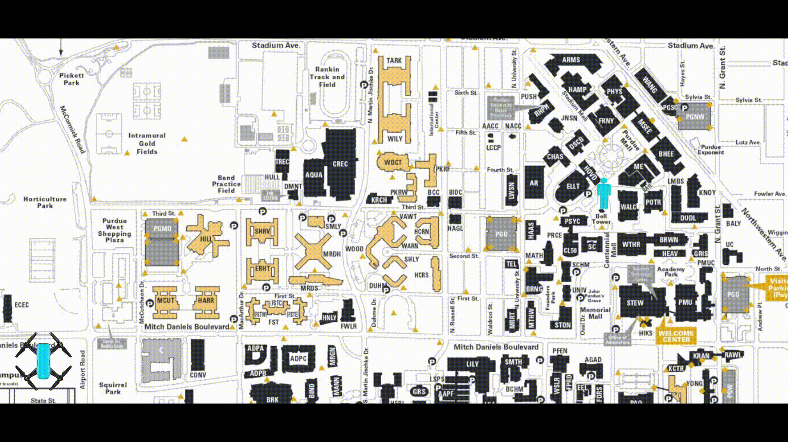
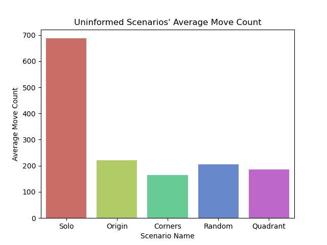
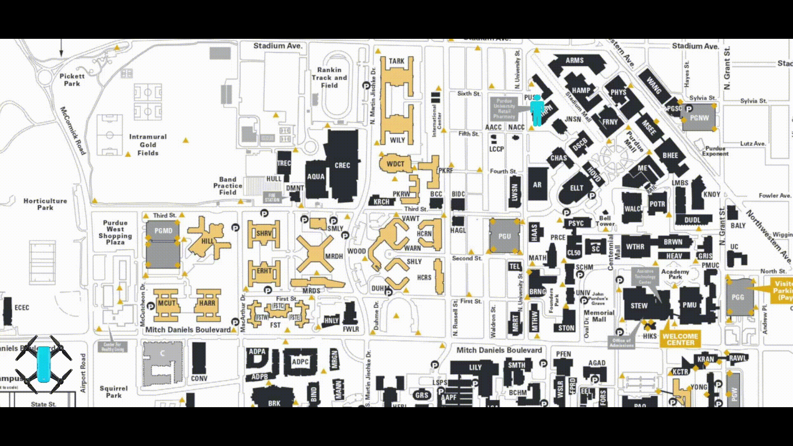
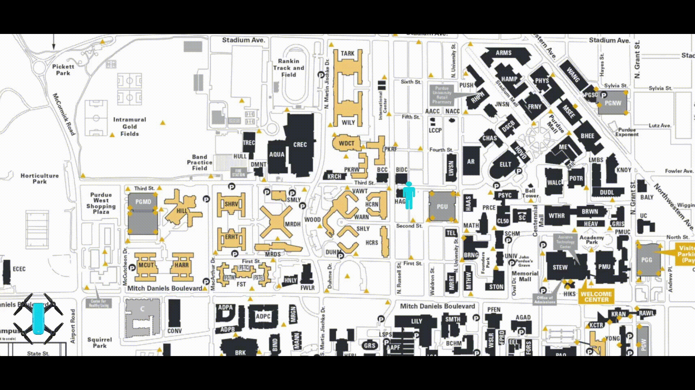
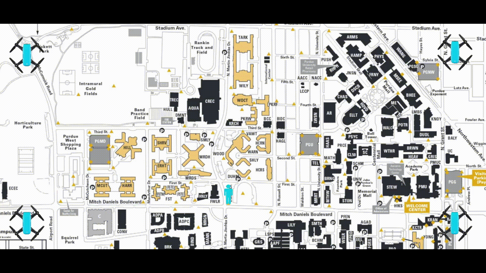
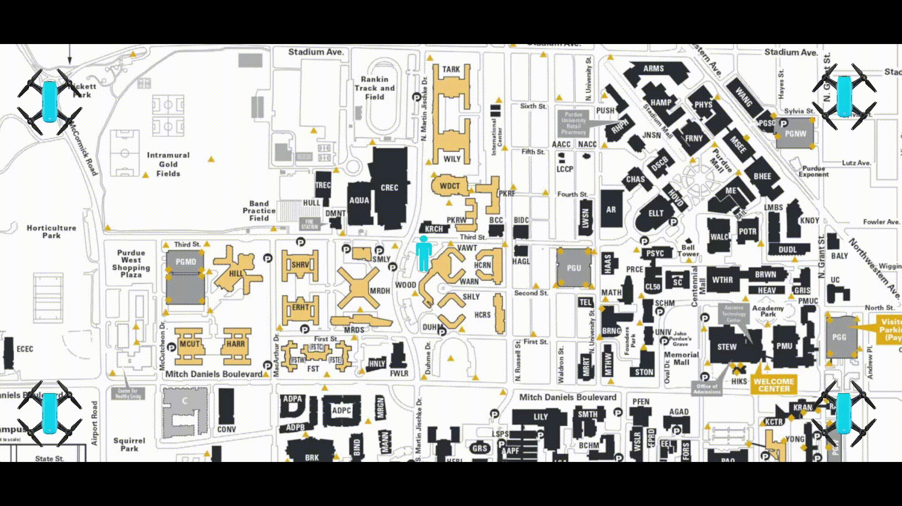
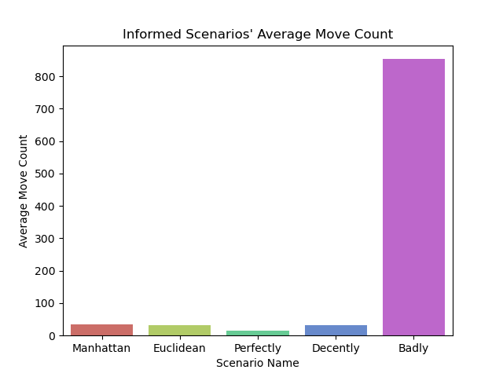
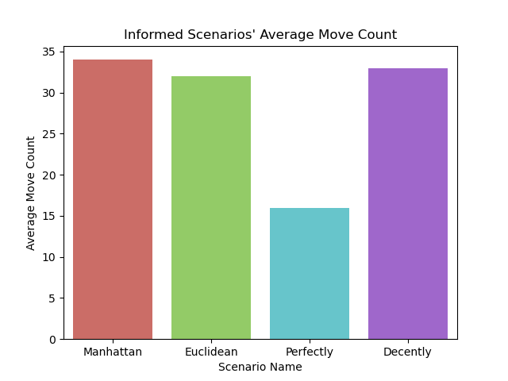
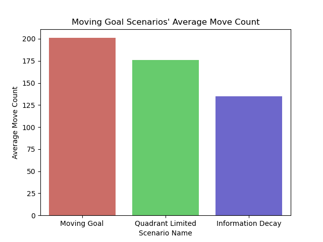

# UAV Flight Pathing

## Project Overview

Hello! This is my final project for my Systems of Networks class. :grinning: 

This project aims to find the optimal pathing algorithm for a system of drones to find a given target. Each drone will have access to the spaces adjacent to them as well as a heuristics and times explored array. These will be utilized by the different algorithms to solve different problems more efficiently. For all uninformed drones, they will attempt to move to a space that minimizes the number of times it and its surrounding tiles has been explored. To determine if an algorithm is more optimal than another we will examine how many moves it takes on average to reach the goal. If there are multiple drones, we will consider one move as all of them moving once, since we want to minimize time, not work. Each move count listed will be the average from a 50 x 50 arena and 100 iterations.

## In Action

### Scenarios 1-5: Uninformed

#### Scenario 1: Solo Uninformed Drone

The first objective we want to explore is whether it is better to have more drones than one.

The average move count for this scenario is 687 moves.

#### Scenario 2: Multiple Uninformed Drones at Origin

The average move count for this scenario is 220 moves. Thus, clearly having more drones is much better than one. We will use this as the base case going forward. Next, we will test different spawn locations.

#### Scenario 3: Multiple Uninformed Drones at Corners

The average move count for this scenario is 165 moves.

#### Scenario 4: Multiple Uninformed Drones at Random Points

The average move count for this scenario is 206 moves.

#### Scenario 5: Multiple Uninformed Drones at Random Points in Each Quadrant

The average move count for this scenario is 185 moves.

#### Uninformed Move Count Data:

Interestingly, the corner spawn location performs the best out of all of them. You might initially expect the random quadrant to perform better since it is more likely to be near the goal, however the drones move randomly so if they aren't one tile adjacent, then they might miss the goal and leave their quadrant. On the other hand, starting in the corners is a good way to get each drone to search a good amount of their initial quadrant. We will use corner spawning as the base case going forward.

### Scenarios 6-10: Informed

Then, we want to see how a heuristic based on the goal affects the drone's search quality. We will spawn at the origin for this one to get a longer path on average to the goal, giving us more time for the better heuristic to get ahead.

#### Scenario 6: Multiple Manhattan Informed Drones at Origin

The first heuristic we want to consider is the Manhattan distance heuristic of the drone and the goal, which is simply the absolute value in the difference in the X coordinates plus the absolute value of the difference in the Y coordinates.

The average move count for this scenario is 34 moves.

#### Scenario 7: Multiple Euclidean Informed Drones at Origin

We want to compare this with the Euclidean distance heuristic, which is the diagonal distance between the drone and the goal using Pythagorean theorem.

The average move count for this scenario is 32 moves. We can see that the Euclidean distance performs slightly better than the Manhattan distance. This is because it weights diagonal moves less harshly than the Manhattan distance, leading to a more direct diagonal path to the goal. This will be our baseline heuristic for the rest of the scenarios.

#### Scenario 8: Multiple Euclidean Informed Drones at Corners

Just to confirm, let's see how it does with drones spawning at the corners.

The average move count for this scenario is 16 moves.

#### Scenario 9: Multiple Decently Euclidean Informed Drones at Corners

In real life, however, we will never have truly perfect information on where the target is. So, to simulate decent information, we can add a random float between -5 and 5 to each heuristic value.

The average move count for this scenario is 33 moves. We can see that it performs worse but more realistically.

#### Scenario 10: Multiple Badly Euclidean Informed Drones at Corners

What if our information is incorrect? This scenario tries to display what happens if you rely too heavily on poor information by giving the distance between the drone and a random tile chosen at runtime.

The average move count for this scenario is 853 moves. It turns out that bad info is even worse than one drone moving randomly.

#### Informed Move Count Data:

Because the badly informed scenario has such a drastically different move count than the others, here are graphs with and without it included.

### Scenarios 11-13: Moving Goal

What if our target knows it is being tracked? These scenarios explore how to best respond to a goal that moves every other move.

#### Scenario 11: Multiple Decently Euclidean Informed Drones at Corners with a Moving Goal

The average move count for this scenario is 201 moves.

#### Scenario 12: Multiple Quadrant-Limited Decently Euclidean Informed Drones at Corners with a Moving Goal

To improve our performance, we can limit each drone to its respective quadrant to ensure maximum division of area.

The average move count for this scenario is 176 moves. It performs slightly better, but better nonetheless.

#### Scenario 13: Multiple Quadrant-Limited Decently Euclidean Informed Drones at Corners with Information Decay and a Moving Goal

To even further improve performance, we can stop using our heuristic function after a certain number of moves and return to our uninformed times explored minimization heuristic. The number of moves I chose was when the ratio of the fastest possible route to the center of the arena to the current move count was less than a random float between 0.5 and 1. This means that after between the number of moves to make it to the center and two times this value, we no longer care about our informed heuristic. We essentially realize after we are moving for a bit and still haven't found the goal that our initial heuristic is no longer useful since clearly the target is moving.

The average move count for this scenario is 135 moves. This is a tremendous improvement from the first attempt.

#### Moving Goal Move Count Data:

### Conclusions 
- Uninformed Scenarios
    - The more drones, the better.
    - Deploying at corners is most reliable and feasible
- Informed Scenarios
    - Euclidean distance outperforms Manhattan distance
    - Information accuracy is key
- Moving Goal Scenarios
    - Limited drones to quadrants ensures equal division of search space
    - Information decay turns a good heuristic great
